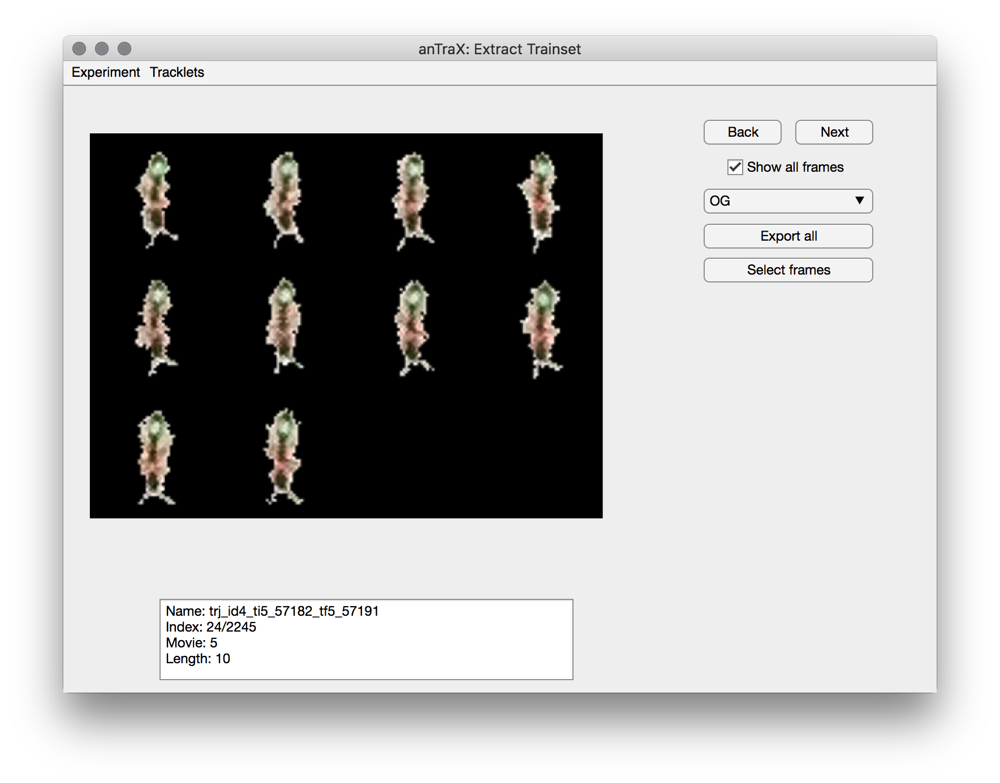
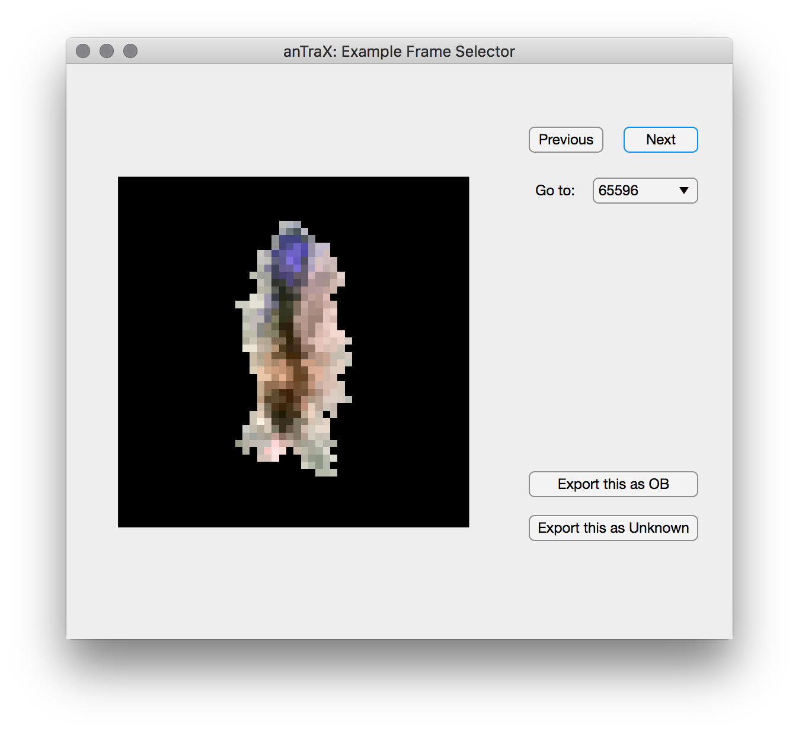
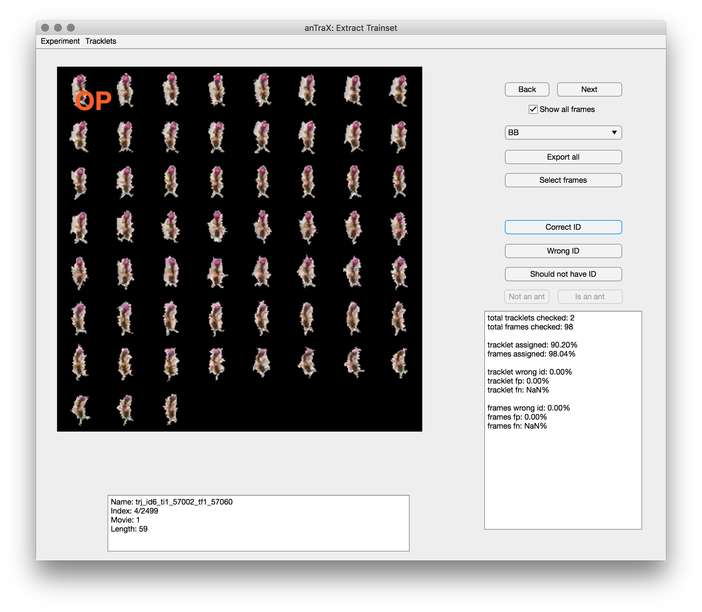

### Classification workflow

In this step we will classify each tracklet that was marked as a possible single-ant tracklet. Each of these tracklets will be assigned as either:

* An ID from the list of possible IDs
* A non-ant tracklet, either as a general category or a specific one if such exist in the classifier.
* A multi-ant tracklet
* An ambiguous tracklet ('Unknown') in case the classifier couldn't make a decision.  

Each tracklet is classified by first classifying all blob images belonging to that tracklet, using the *blob classifier* and then weighting these classifications to produce a whole tracklet classification. The blob classifier is a trained deep convolutional network (CNN), that needs to be trained on a trainset of pre-classified blob images. 

### Creating a training set

anTraX includes an interactive GUI application to prepare such a training set from a tracked experiment. To launch the GUI, type and run in the terminal:

```console
antrax extract-trainset <expdir> [--session <session>]
```

The app will display blobs images from a randomly selected tracklet, as well as info about the tracklet in the text-box below. Using the buttons on the right, you can select the label appropriate for the tracklet, and either export all images to the train set (using the ***export all*** button), or select a subset using the 'select frames' button (a frame selection window will open). You can move between tracklets using the ***Next*** and ***Back*** buttons.
See the [tips and best practices](tips.md#training-and-classification) page regarding what are good training set examples.

By default, the app will load tracklets from the first tracked movie. Tracklets from other movies can be loaded using the ***Tracklets*** menu.






### Merging training sets

The exported examples are saved as images in the experimental directory, under `/session/classifier/examples/id/`. When creating a classifier specific to that experiment, training can be done from that directory. However, in order to create a general classifier to be used on many experiments, it is necessary to create a training set that contains examples from several experiments. This can be done with the command:

```console
antrax merge-trainset <source-classdir> <dest-classdir>
```

This will merge all the examples from the source classifier directory (usually `expdir/session/classifier`) into the destination classifier directory. It is recommended to keep multi-experiment classifiers separate from any specific experimental directory to avoid confusion.

**Important:** the user is responsible for making sure the lists of labels match when merging trainsets. Otherwise, problems might occur.

### Training the classifier

To train the classifier, run: 

```console
antrax train <classdir> [OPTIONS]
```

The `classdir` argument can be either a full path to the experimental directory containing the classifier, or to the directory containing the `examples` directory, and where the classifier will be saved.

The train command accepts the following options:

`--scratch`

By default, anTraX will load a pre-trained classifier if it exists in the `classdir` directory, and run incremental training. If the `--scratch` flag is used, it will initialize a new classifier instead. 

`--ne <ne>`

Number of training epochs to run. Default is 5.

`--hsymmetry`

Use this flag if your tagging is symmetrical to horizontal flips (this is used in the dataset augmentation process). This option can be used either for a new classifier, or together with the `--scratch` options.

`--target-size <size>`

The side length (in pixels) of the input image to the classifier (anTraX always use square images for classification). This option will only take effect if a new classifier is trained. By default, the size will be that of the first image read from the trainset. All other images will be resized to the target-size. This option can be used either for a new classifier, or together with the `--scratch` options.

`--name <name>`

Use a custom name for the classifier. 

`--arch <arch-name>`

If you want to use a non-default architecture for the CNN (see next section for options). Acceptable values are `small|large|wide|MobileNetV2|custom`. In case `custom` is chosen, you will need to also include the `modelfile` option. It is highly recommended to start with the default architecture, and explore different ones only for complex problems. This option can be used either for a new classifier, or together with the `--scratch` options.

`--modelfile <jsonfile>`

A path to a json file containing a CNN model [serialized by keras](https://www.tensorflow.org/guide/keras/save_and_serialize). Note that only the model architecture is loaded, not a trained model. The number of classes in the model must match the number of classes in your tracking problem. This option can be used only together with `--arch custom'.


### anTraX-supplied CNN architectures

anTraX defines a few possible CNN architectures. To see a complete specification of the architectures, look at the [models.py](https://github.com/Social-Evolution-and-Behavior/anTraX/blob/master/antrax/models.py) file in the anTraX repository.

* **small**: This is the default architecture, which we have found to give the best trade-off between accuracy, training time, and number of examples needed. It has 3 convolutional layers.  

* **wide**: Also a 3-layered model, but with wider layers and hence slower to train.

* **large**: A 4-layered model.

* **MobileNetV2**: A pre-trained [MobileNetV2](https://arxiv.org/abs/1801.04381) model. 


### Classifying tracklets

To run classification in batch mode:

```console
antrax classify <experiments> [OPTIONS]
```

The `experiments` argument can be either a full path to an experimental directory, a full path to a text file with a list of experimental directories (all of which will run in parallel), or a full path to a folder that contains one or more experimental directories (all of which will run in parallel).

The classify command accepts the following options:

`--classifier <path-to-classifier file>`

Explicit path to a classifier (`.h5` file created by the train process). By default, anTraX will use the classifier file that exists in the default location in the experimental directory `expdir/session/classifier/classifier.h5`. If it doesn't exist, an error will be raised.

`--movlist <list of movie indices>`

By default, anTraX will track all movies in the experiment. This can be changed by using this option. Example for valid inputs incluse: `4`, `3,5,6`, `1-5,7`.

`--session <session name>`

If your experiment contains more than one configured session, anTraX will run on the last configured one. Use this option to choose a session explicitly.


### Validating classification and retraining 

Once the tracklets in the experiment are classified, the *extract-trainset* app can be used to validate the results and export new examples if needed. For a classified experiment, the app will display the assigned label for each displayed tracklet. If it is incorrect, or if it is unclassified (labeled 'Unknown' although it is identifiable), you can add its images to the training set the same way as before. Don't forget to choose the correct label before exporting!

The ***Filter by autoID*** option in the ***Tracklet*** menu can be used to show only tracklets assigned with a specific label. 

Optionally, you can formally evaluate the performance of the classifier by marking each classification as ***Correct***, ***Wrong*** or ***Should not have an ID*** (if the tracklet is not identifiable). Doing that for a set of tracklets will give an estimate of the classifier performance per-tracklet and per-frame.

Once the training set has been expanded, train the classifier and re-run classification in the same way as before.


