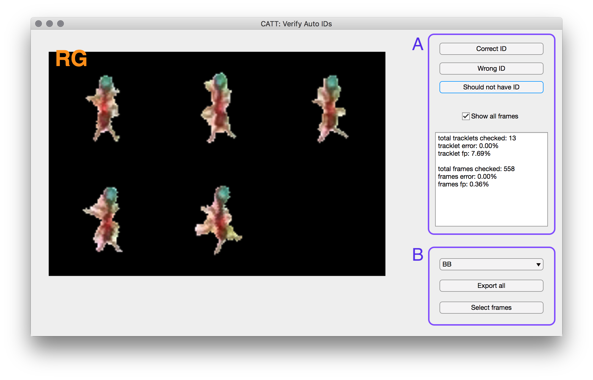
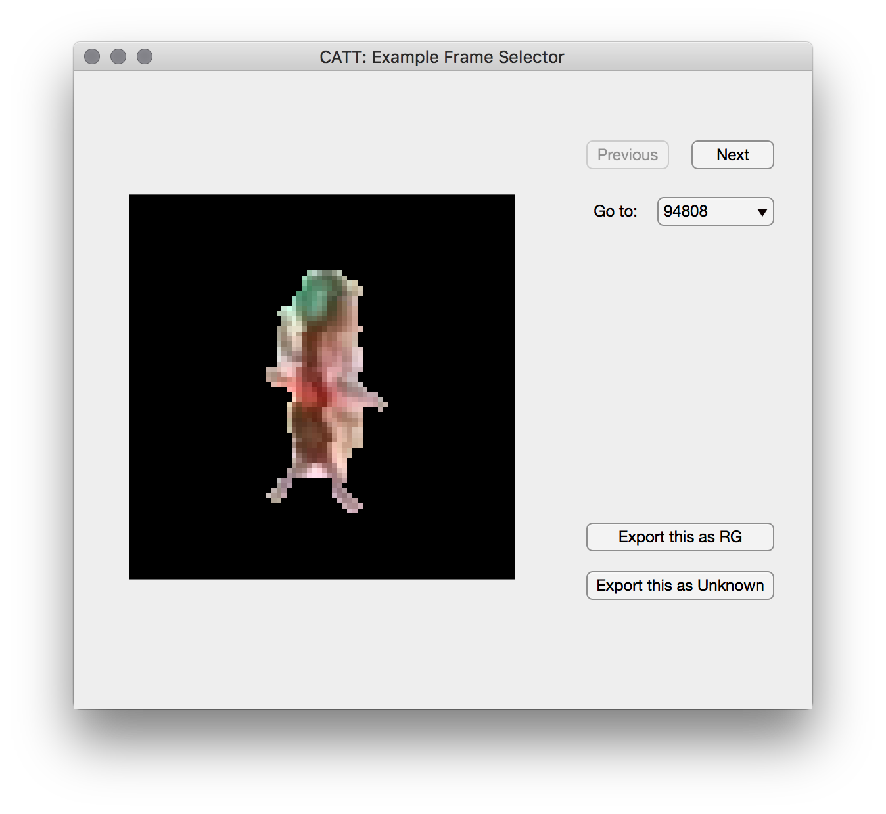

In this step we will classify each tracklet that was marked as possible single ant tracklet. Each of these tracklet will be assigned as either:

* An ant ID from the list of possible IDs
* A non-ant tracklet, wither as a general category or a specific one if such exist in the classifier.
* A multi ant tracklet
* An ambitious tracklet ('Unknown') if the classifier couldn't make a decision.  

Each tracklet is classified by first classifying all cropped images belonging to that tracklet, and then weighting these classifications into a single tracklet class.

### The image classifier

Classification is done by calling a python program that runs tensor-flow neural network. The classifier 'lives' in a directory separate from the experimental directory, and can be shared between experiments. The classifier directory contains a file that stores the neural network topology and parameters in `classdir/model.h5`, and a sudirectory named `examples` that contains a data set of labeled images used for training. The example images are organized into subdirectories named by their labels. 

If you have an existing classifier you would like to use, define it in the Trck object:

```
Trck.classdir = <path-to-classifier-deirectory>
```

Alternatively, a new empty classifier can be created with the labels of the current Trck, by using the command `new_classifier`:

```
new_classifier(Trck,<target_directory>,<classifier-name>);
```

The new classifier will also be defined as the classifier of the current tracking session. To fill this classifier with examples, you can use the `verify_autoids_app` as explained [below](https://github.com/Social-Evolution-and-Behavior/CATT/wiki/Classify-tracklets#validate-classifications), and/or copy examples from other classifier directories.

Examples for pre-trained classifier directories can be found here (LINK).

### Train an image classifier

Assuming the examples are organized in the directory `classir` as explained above, the classifier can be trained from the MATLAB command lines. You can either choose to train a model from scratch, which can take several hours depending on your machine and complexity of data set, or to do an incremental training, which can take around 20 minutes. The latter is recommended for cases where examples from a new experiment are added to an existing classifier. 

From the MATLAB command line, run:

```
train_classifier(classdir,'from_scratch',true);
train_classifier(classdir,'ne',10);
```

Where `ne` is the number of epochs for incremental training. 

You can also run the python training command directly from the system terminal:

```
cd <catt-dir>
pipenv shell
python ./python/train.py <path-to-classdir> --ne 10
python ./python/train.py <path-to-classdir> --ne 100 --from_scratch
```


### Classify tracklets

To classify tracklets, run:

```
classify_batch(Trck);
classify_batch(Trck,'movlist',<list of video indices>);
classify_batch(---,'nw',<number>);
```

The `nw` option will limit the number of cores used.

By default, the program tries to filter frames in which she thinks the images are not good enough. This process is sometimes not optimal. You can try skipping this filtering by running classification with the option:

```
classify_batch(---,'usepassed',false);
```

### Classify tracklets on HPC

TBD

### Validate classifications

Once classification is done, the accuracy can be estimated by launching the validation app:

```
verify_autoids_app(Trck);
```

Note that it might take a few minutes for the app to aggregate the list of tracklets for validation, especially if the experiment is long and/or multi colony.



The app will display random classified tracklets from the experiments. If the displayed tracklet was assigned with a valid ant ID, you can mark it as correct, wrong, or false positive (i.e. should not have been assigned with an ID). If the displayed tracklet was assigned with a non-ant label, you can mark it as false negative if it is an ant, or just skip to next to mark it as correct. Note that we don't count correctness in assigning the various non-ant labels here. The stats will be appear in the text window, both as per-tracklet error and per-frame error. Ambiguous tracklets are shown but do not have an error response (saying 'I don't know' is not considered an error).  

When a tracklet is misclassified, or marked as unknown, you have the option to add its images as examples in the classifier directory. For doing that, choose the correct label from the dropdown menu. If you wish to export all images of that tracklet (be careful, always check the images first), press the **Export all** button. IF only a subset of frames are good examples, press the **Choose frames** button. A second window will appear:





In that window, frames from the tracklet will be presented one by one. For each, either select **Import as ID** if it is a good example (rule of thumb: if you can say which ant it is by this image alone), select **Import as unknown** if it is definitely an unrecognizable image. If in doubt, skip this frame by pressing **Next**.


**Important**: if you made an error while marking the tracklet as correct/wrong/etc, you can correct by going back and re-marking the tracklet, and it will fix the stats appropriately. However, if images from a tracklet were exported as examples under the wrong ID/label, it is not enough to re-export them under the correct label. You will have to open the classifier directory in the systems's file explorer, look under the wrong label you exported, and delete the images. It is useful to sort by modification date and look at the most recently modified.  