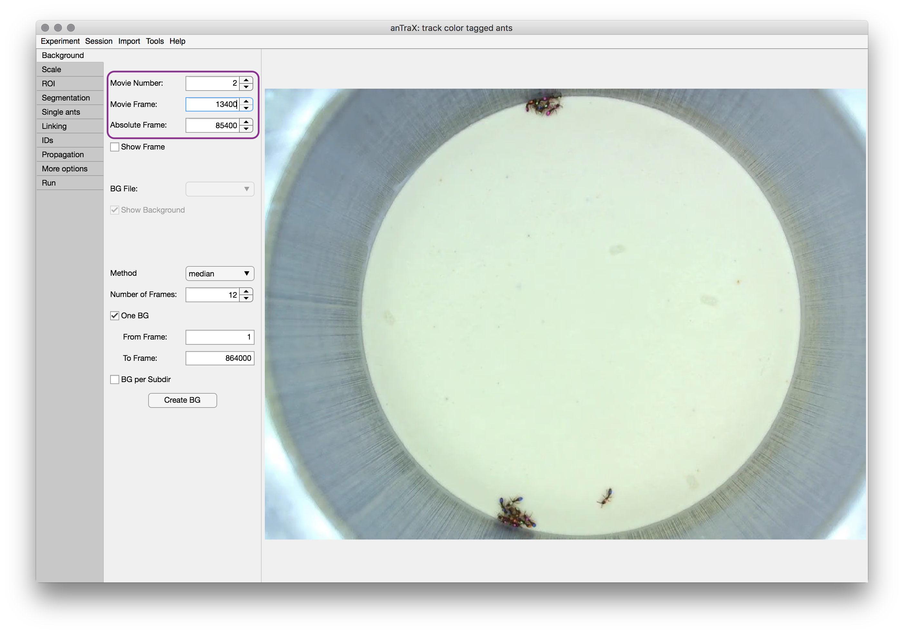
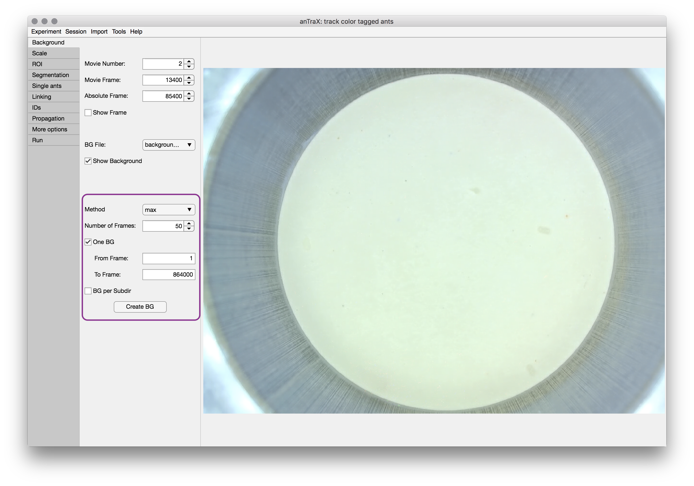
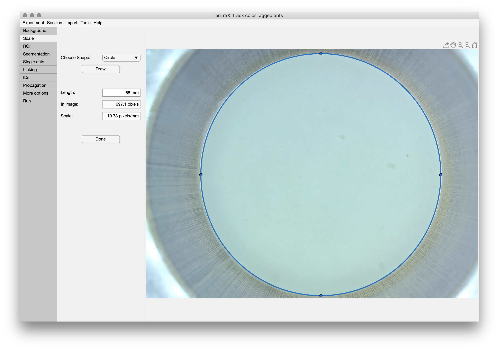
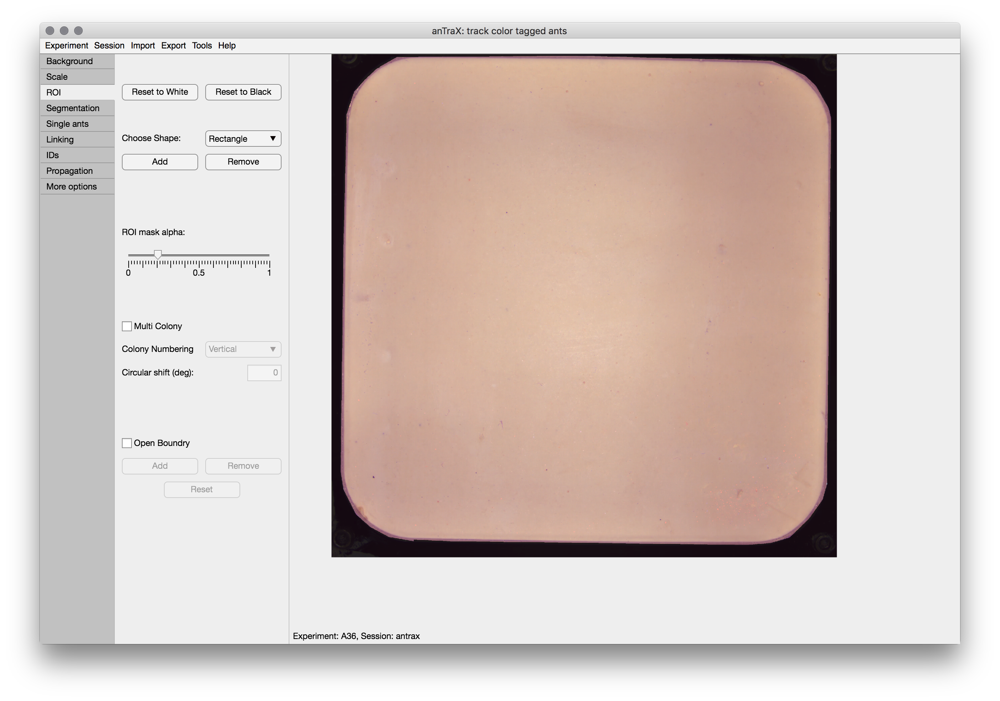
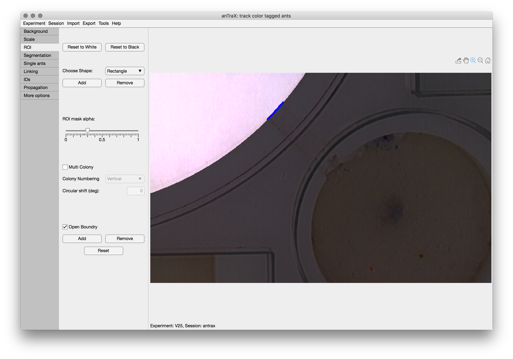
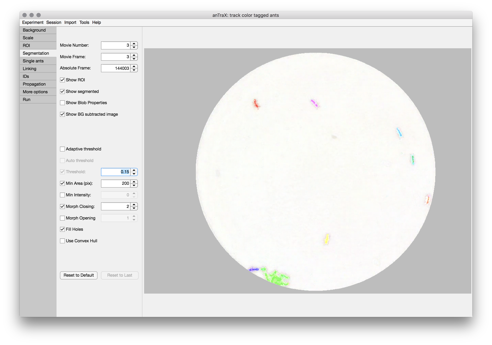
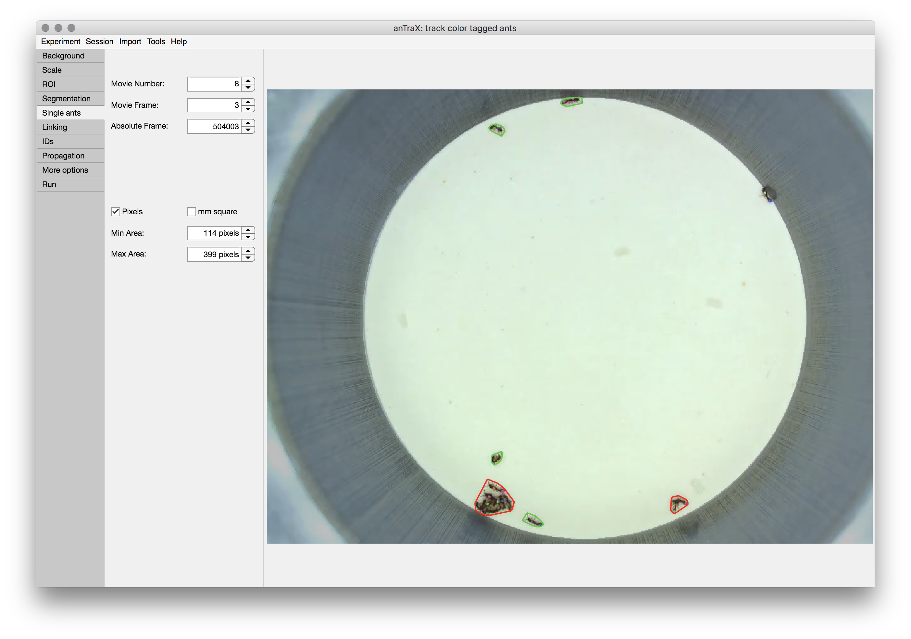
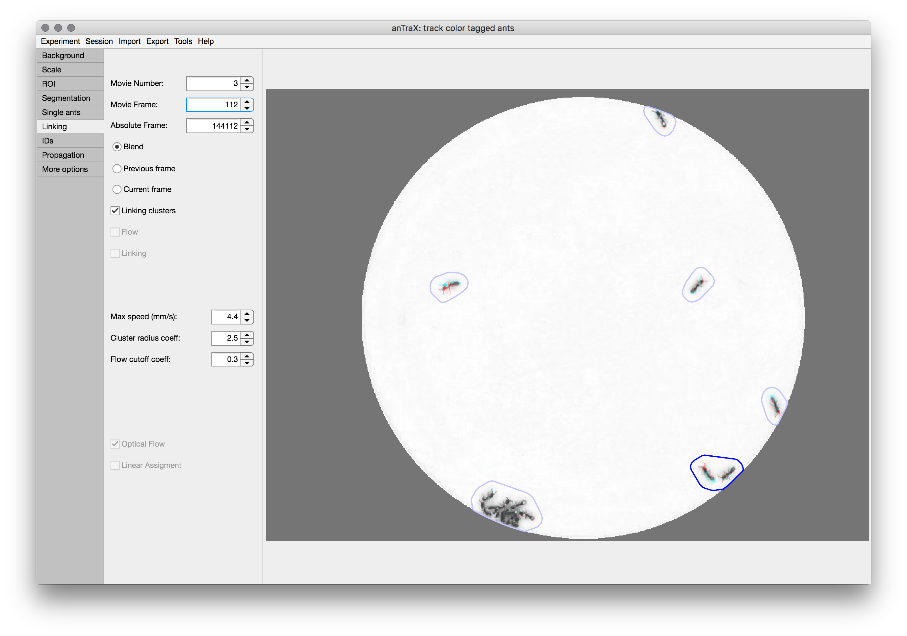
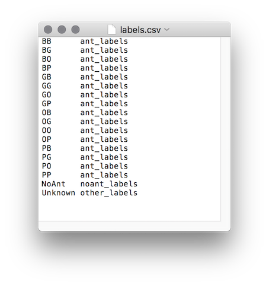

### What is a session?

A tracking *session* is a run of the algorithm with a set of settings and parameters. In the typical case, you will only create one session per experiment. However, it is sometimes usefull to play around with a different parameter set without overwriting existing results, or track different parts of the experiment with different parameter sets. In these cases, multiple sessions should be created. The session, together with its parameters and results, is stored as a subdirectory of the experimental directory and is named by the session identifier name.

### Launching the anTraX app

To create and configure a tracking session, simply launch the anTraX app by entering the command into a bash terminal (don't forget to activate your virtual/conda environment if are using one):

```console
antrax configure [expdir]
```

The optional argument `expdir` is a full path to the experimental directory to be configured. If omitted, a directory selection dialog will appear to select the experiment. You can move between experiments by using the options in the `Experiment` menu.

Any configuration changes are saved on-the-fly. When finished, just exit the app and the session will be saved. 


### Creating/loading a tracking session

If the experiment contains a previously  configured session, it will automatically load. Otherwise, you will be prompted to create a new one. Once a session is loaded/created, the configuration workflow will appear as tabs in the application window (see images below).

You can move between sessions, or create new ones, by using the options in the `Session` menu.

### Displaying video frames
The anTraX application window is divided into two main parts: configuration panel on the left, and the frame viewer on the right. The configuration panel contains multiple tabs corresponding to the algorithm step. The displayed image will be augmented according to the configuration tab currently active.
The frames in the experiment can be browsed using the selectors on the top part of the configuration panel (outlined in purple), which will appear in most of the configuration tabs. A frame in the experimement can be defined either by its video index (the ***Movie number***) and the frame index in that video (the ***Movie frame*** selector), or by its total index in the experiment (the ***Absolute frame*** selector).



### Creating a background image

The first step in the configuration process is to generate a background image.

Use the ***method*** dropdown to select between the possible background computation methods. The ***median*** method computes the background as the per-pixel per-channel median of a set of randomly selected frames. The ***max*** method computes the background as the per-pixel per-channel max value. Select the number of frames for generating a background image. Obviously the more frames that are used, the better the background frame is, especially when median method is used. However, 20 will usually give a good trade-off between computation time and quality. Frames are randomly selected from the frame range.

***One BG*** option will generate a single background to be used throughout the tracking. With this option, you can select a frame range for selecting frames (useful for cases where some parts of the experiment are more suitable for background calculation).

***BG per subdir*** will generate a separate background frame for each subdirectory of videos. This option is useful for cases where there are movements between the location of the arena in the frame between recording session, or some other change in filming conditions.

The ***Create BG*** button will start the background creation process. Depending on the parameters, this might take several minutes. After the computation is done, the new background will be displayed. If several backgrounds are created, you can choose which one is displayed from the BG file dropdown menu.

The background images are saved as png files in the directory `expdir/session/parameters/background/`.




### Setting the spatial scale
In the second tab, the spatial scale of the videos will be defined. This is required to have all the parameters and results in real world units, which is essential for  parameters to be generalized between experiments and tracking results comparable between experiments.

To set the scale, choose a feature in the image of which the dimensions are known. Choose the appropriate tool from the drop down menu (either ***Circle*** or ***Line***), press the ***Draw*** button, and adjust the tool to fit the feature.

When done, enter the Length/Diameter of the feature in *mm* in the box, and finish by pressing the ***Done*** button.



### Creating an ROI mask

The ***ROI Mask*** (Region Of Interest) is used to define the regions of the image in which tracking is performed. 

To set a mask, start by either a white mask ("track everywhere") by pressing the ***Reset to White*** or a black mask ("track nowhere") by pressing the ***Reset to Black***. Then, add and remove regions by selecting a tool from the dropdown and drawing on the image. Adjust by dragging the anchor points. When done, double click the tool. You can repeat this process untill the ROI is ready.

The ROI mask is saved as png files in the directory: `expdir/session/parameters/masks/`.



### Multi-colony experiments

The ***Multi-Colony*** option is used to control how a mask with several disconnected ROIs should be treated if these regions correspond to separate ant colonies. If checked, each of these regions will be treated as a separate colony, containing a full and fixed set of identified ants, and will be saved separately. Use the dropdown to control the numbering order of the ROIs, and the Assign colony labels buttons to manually assign labels to each numbered colony (avoid white spaces in the labels).

The colony masks are saved as png files in the directory: `expdir/session/parameters/masks/`.


### Open boundary ROIs

The ***Open Boundary*** option is used to mark parts of the ROI perimeter that are "open" to ants getting in and out of the ROI. This is used to optimize tracking in these regions. Otherwise, the ROI is assumed to be completely closed. To mark a segment of the boundary as 'open', click ***Add*** and adjust the shape, so its intersection with the ROI boundary will be the open region. Double-click to finish. The 'open' segment will be marked with thick blue line.



### Tuning the segmentation

After subtracting the image from the background, anTrax segments the image into foreground and background, with the foreground being composed of several connected components ('blobs'). This is a multi-parameter process that should be tuned for each experiment. 

On the ***Segmentation*** tab, several of the segmentation parameter can be tuned, while displaying the results. The control parameters include:

* ***Segmentation threshold:*** in units of gray value difference between image and background.
	
* ***Adaptive threshold:*** if checked, the threshold will be adjusted locally as a function of the background brightness, causing the segmentation to be more sensitive in darker areas.
	
* ***Min area (pixels):*** Blobs below this threshold are discarded.
	
* ***Closing (pixels):*** Optional morphological closing, that merge blobs separated by few pixels.
	
* ***Opening (pixels):*** Optional morphological opening, eroding thin pixel lines.
Min intensity (gray level). Blobs with maximum intensity lower than this value will be discarded.

* ***Convex hull:*** Fill in the blob convex hull. Using in cases where there is bad contrast between parts of the ant and the background.
	
* ***Fill holes:*** Useful when very bright tags are used, that do not have good contrast with the background and appear as 'holes' in the blob.
	
* ***Min intensity:*** Optional blob filter, which discard blobs with maximal intensity lower than the threshold value.

The display of the segmented frame can be configured usng the checkboxes below the frame selectors: ROI mask can be turned on/off, blobs can be shown as convex hull curves (default) or as colored segmented regions (better to check the fine details of the segmentation). Text showing the blob area in pixels and maximum intensity value can be displayed. 



### Tuning single individual size range

anTrax uses the size of an individual ant for filtering possible single ant tracklets for classification and for calibrating the linking algorithm. The single ant size is defined by the possible size range, which is adjusted in the ***single ant*** tab. For tuning these range parameters, the blobs detected in the displayed frames are marked with green outlines if they are in the single ant range, with red if they are larger, and with pink if they are smaller. It is recommended to scan a decent number of frames throughout the experiment to look for near-threshold cases. Note, the range doesn't need to perfectly classify blobs; rather, it captures the possible size range for single ants. If your experiment contains individuals with variable size, choose the range to capture all the individuals, even at the 'price' of classifying some multi-animal blobs as single-animal.




### Tuning the linking step

Linking is the process of connecting blobs from consecutive frames into tracklets. Linked blobs are assumed to represent a case where some or all of the ants that are included in the blob from the first frame also included in the blob in the second frame. A blob can be linked to zero, one or multiple blobs in the the other frame. 

As described in the paper, anTraX uses optical flow to link blobs. This is used whenever a blob has more than one possible blob to link to inside its "linking cluster".

The displayed image can be selected as the "previous frame", "current frame", or "blend" (an overlay of the two frames in different color channels). It is also possible to display the linking clusters by selecting the checkbox. Clusters with more than one blob in one of the frames (which will undergo optical flow) will be marked with bright blue contours, while other clusters will be marked with dim blue contours.

* **max speed**: This is the typical maximum velocity possible by the tracked individual animals. It is used to calculate the max possible distance for an animal to move between frames (taking into account the specific time interval). 

* **linking cluster coefficient**: The coefficient multiplies the max possible distance to get a conservative radius for the linking cluster (this parameter should not be changed regularly). 

* **optical flow cutoff coefficient**: When optical flow is used, a flow index will be computed between each blob pair. The pair will be linked if the index is above a cutoff threshold. The cutoff threshold is set by the middle of the single animal range set in the previous tab, times this coefficient. Generally, the linking process is relatively robust to the precise value of this parameter. However, in some cases, increasing it might lead to an increase in false negative linking errors (missed true links), and decreasing it might lead to increase in false positive linking errors (wrong links). 



### Entering individual tags information 

The **IDs** tab is used to configure the list of ant IDs used in the experiment. First, set the tagging type as either *untagged* (experiments without color tags; no classification will be done), *group-tagged* (non individual tags; tracklet classification will be done, but no graph propagation) or *individual-tagged* (ants marked with unique IDs). 

Before classification, you will need to provide the program a list of the ants in the experiment (identified by their color tags). In case your classifier is trained to identify other types of objects (food, brood, prey insect, etc.) you will need to provide these as well.

The list of labels must match the the one the classifier is trained with (read more about [classifiers](classification.md)).

If your experiment is a multi-colony one, it is assumed the ID list is the same for all colonies in the experiment. If it is not the case, give a list that include all possible IDs, and adjust it using a config file as described [below](configuration.md#modifying-the-id-list-using-temporal-config-file).

The label list is defined by the file `expdir/session/parameters/labels.csv`. Each row in the file contains two entries. The first is the label ID, and the second is the category. Three categories exist: ant_labels, noant_labels, and other_labels. The list must include the label 'Unknown' in the 'other_labels' category. If the animal size variability in the experiment is considerable, and many multi-individual blobs are classified as single-animal (see discussion [above](configuration.md#tuning-single-individual-size-range)), it is recommended to include also a 'Multi' class in the 'other_labels' category.  



The ***IDs*** tab is an easy way to configure the list of labels for cases where animals are marked with two color tags: First, check the boxes of the color tags used. A label list containing all possible combinations will be created. Next, trim the list to include only the actually used combinations. Finally, add no-ant labels as needed. 

### Tuning the graph propagation step

The **Propagation** tab is used to configure the graph propagation step. 

Propation is done in parallel on movie groups. You can select how movies are grouped using the **Group by** drop down list. The ***movie*** option will processed seperately. This is the fastest option, but will be less optimal near the start/end of the movie. It is appropriate for either long movies or when movies are not continious in time. The ***subdir*** option will group movies according to the subdirectory organization (see the [data organization page ](data_organization.md)). The ***experiment*** option will group all movies in the experiment together. This is the slowest option, and is recommended only for short experiement (less than 24 hours). The ***custom*** option allows the user to define custom movie groups.

The groups are enumerated by sequence of integers from 1 to the number of groups. This enumeration is used in the [batch run](propagation.md#propagating-ids-on-tracklet-graphs) to identify the group.

The **Pairs search depth** parameter controls the graph radius over which the algorithm search for topological propagation opportunities (see the [anTraX paper]). High number might give better results, but will overhead the algorithm. A value between 5-10 usually gives the best tradeoff.

The **Max iteration** parameter imposes a limit on the number of total iterations the propagation algorithms performs. In most cases, the algorithm converges after a few iterations. For the rare cases where it does not, a value of 10 usually represents a good tradeoff.

The **Impossible speed** parameter is used to filter out cases where the algorithm assigns IDs to tracklets that represent an impossible traveling speed for an ant. Use a very conservative value here, as many times there is a lag in the movie (as a results of skipping frames in the recording) that is not captured correctly by the interval frame data. A value of at least twice the max speed is recommended. 

The **temporal config** option tells the program to use the commands in the temporal config file (see below).

The **manual config** option tells the program to use manual ID assigments (see [later in the documentation](propagation.md#using-the-graph-explorer-to-view-and-debug-id-assigments)).

### Modifying the ID list using temporal config file

Optionally, a configuration file can be written for adjusting the ID list per colony or per time. Currently, the config supports ***remove** commands. The file should be text file located in `expdir/session/parameters/ids.cfg`. Each line in the file is interpreted as a command in the format:

```console
command colony id from to
```

The time arguments `from` and `to` can be either `start` for the first frame in the experiment, `end` for the last frame in the experiment, `m` followed by a number for the first frame in a movie (e.g. `m3`), 'f' followed by a number for a specific frame in the experiment (e.g. `f4000`), or a combination of a movie and frame for a specific frame in a specific movie (e.g. `m9f1000`).

To remove the id GP for colony C1 for the entire experiment:

```console
remove C1 GP start end
```

To remove YY for colony C5 from movie 22 to the end:

```console
remove C5 YY m22 end
```

To remove BG for all colonies for frames 20000 to 30000:

```console
remove all BG f20000 f30000
```

To remove PP for colony A from frame 100 in movie 4 to frame 2000 in movie 7:

```console
remove A PP m4f100 m7f2000
```

### The 'other options' tab


TBA