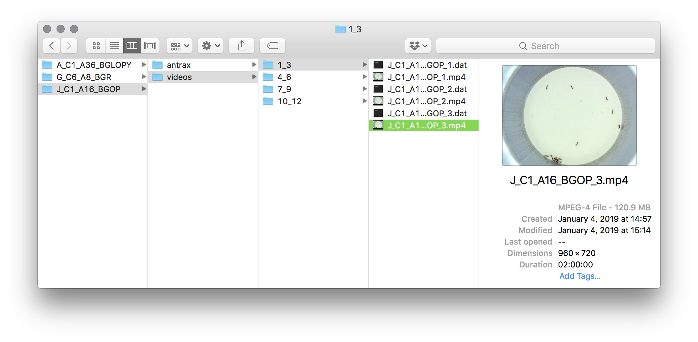
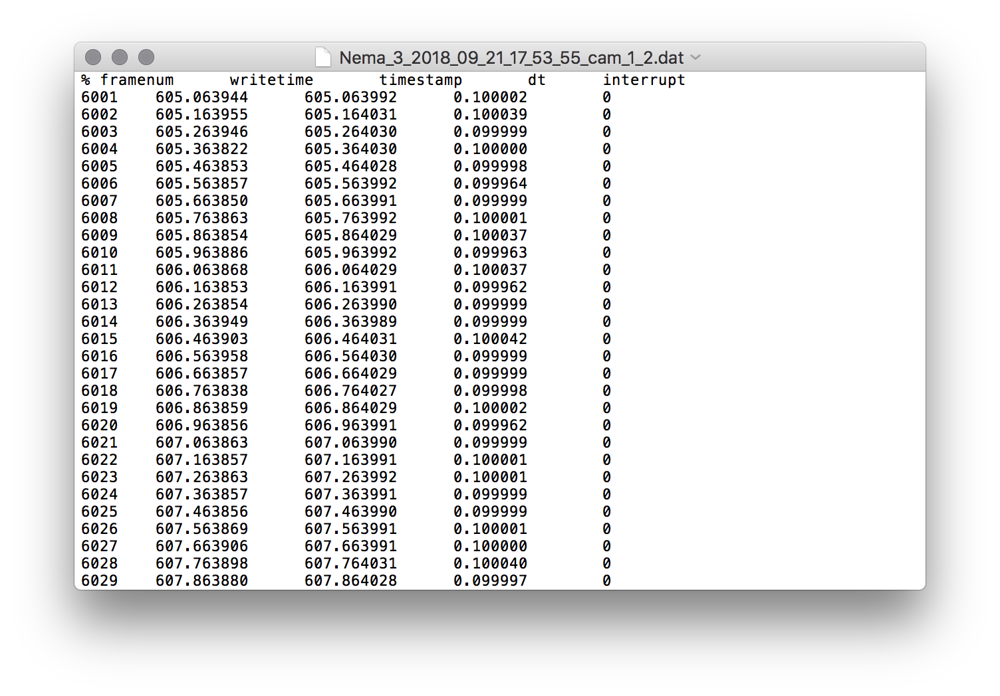

### The experiment directory

The input and output of anTraX are organized in an  "experiment directory" (a.k.a. `expdir`). Under this directory, the program expect to find a subdirectory named `videos`, containing the input files. While running anTraX, a subdirectory for each tracking session will be created under the experimental directory and will store the parameters and results for that session.

### Video files

The input files are a sequence of raw videos, of the same animal group, recorded sequentially and under the same conditions. anTraX can process any [file format and video encoding readable by ffmpeg](http://www.ffmpeg.org/general.html#Supported-File-Formats_002c-Codecs-or-Features), however, all videos are expected to have the same file format, codec, frame size and framerate. Moreover, all videos must have the same base name, followed by a file index suffix seperated with a `_` character. 
Optionally, for convinience, the videos can be organized into subdirectories. This can be a useful way to seperate  some meaningful partition of the experiment such as periods of consecutive recording, change in experimental conditions or feeding events, or just to partition a very long experiment.  The subdirectories should indicate the indexes of the videos stored in them. For example, subdirectory named "1_24" will contain videos 1 to 24.

### The frame data files

Optionally, each video will be accompanied by a frame information file, with the same name of the video and with a `.dat` extension. This file should contain a header row with the variable names (e.g. a timestamp, sensor data, etc.) and a value row for each frame in the video. If the file contains a variable named `dt`, it will be interpreted as the precise inter-frame interval, and will be used for tracking instead of the video framerate parameter.

To see an example for an experimental directory, download one of the [example datasets](datasets.md)

### Using antSpy to record data

If your are using [*antSpy*](https://github.com/Social-Evolution-and-Behavior/antSpy/)  to record data, your data will be automatically organized according to these requirements, and no further action will be needed, antSpy is a Linux/Ubuntu app and will work with any  FLIR/PointGrey machine vision camera that supports the spinnaker SDK, or any UVC camera. and can record from multiple cameras in parallel.  

