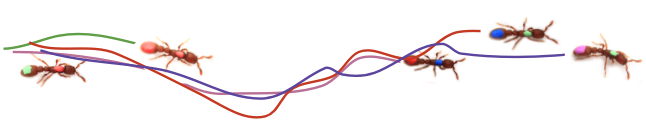

# **anTraX** -  high throughput video tracking of color tagged insects

anTraX is a software for video tracking ants and other small animals that are marked with a unique pattern of color dots. It was originally designed for behavioral experiments using the Clonal Raider Ant [*Ooceraea biroi*](https://en.m.wikipedia.org/wiki/Ooceraea_biroi), but can be used for any other model system. anTraX is a **brute force** type tracking algorithm, prioritizing accuracy over speed, therefore requiring considerable computational resources. It was designed to handle high throughput, long duration experiments (many colonies over many days), and benefits from running on computer clusters.

The software was designed and written by Jonathan Saragosti and Asaf Gal of the [Laboratory of Social Evolution and Behavior](https://www.rockefeller.edu/research/2280-kronauer-laboratory/) in the Rockefeller University, and is distributed under the [GPLv3](https://github.com/Social-Evolution-and-Behavior/anTraX/blob/master/LICENSE) licence.

###References

TBA
