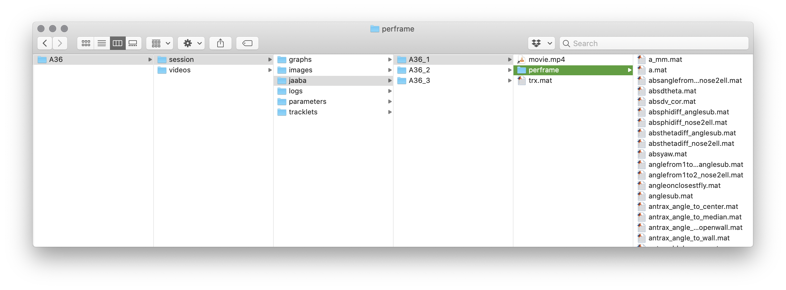

### JAABA

[JAABA (the Janelia Automatic Animal Behavior Annotator)](http://jaaba.sourceforge.net/index.html) is a machine learning-based system created by the [Branson lab](https://www.janelia.org/lab/branson-lab) at HHMI Janelia Farm. It enables users to automatically compute interpretable, quantitative statistics describing video of behaving animals. In a nutshell, it uses a set of user-labeled examples to train a classifier that can spot more occurences of that behavior in new (unseen) data. JAABA works by projecting trajectory data into a high dimentional space of so-called "per-frame features", in which the underlying machine learning algorithm searches for regularities. 
anTraX includes an option to generate these perframe features for experiments tracked in anTraX, as well as functions to run JAABA classifier from the anTraX interface, thus greatly simplifying the use of JAABA for classifying behavioral features in these experiments. 

### The anTraX/JAABA workflow

* Track an experiment using anTraX. 
* Write tracks and per-frame data in JAABA-readable format.
* Train a classifier using the JAABA interface
* Classify the entire dataset using either the JAABA interface or anTraX interface.
* The JAABA-generated scores for each behavioral classifier will be imported together with the spatial coordinates of each animal.

### Install JAABA

Install the JAABA package from GitHub:

```console
git clone https://github.com/kristinbranson/JAABA.git
```

Copy anTraX configuration files into the JAABA directory:

```console
cp $ANTRAX_PATH/matlab/jaaba/*.xml $ANTRAX_JAABA_PATH/perframe/params/
```

Add this variable to your bash profile file:

```bash
export ANTRAX_JAABA_PATH=<full path to JAABA repository>
```
Don't forget to source!

### Write tracks and perframe data for JAABA


```console
antrax export-jaaba <expdir>  

```

The export-jaaba command accepts the following options:


`--nw <number of workers>`

anTraX will parallelize the tracking by video. By default, it will use two MATLAB workers. Depending on your machine, this can be changed by using this option.

`--movlist <movlist>`

By default, all movies will be processed, which might take some time. Change this using this option.

`--session <session name>`

If your experiment contains more than one configured session, anTraX will run on the last configured one. Use this option to choose a session explicitly.

*** Note: *** The `export-jaaba` command does not currently support the `--mcr` or the `--hpc` options.

### The JAABA directory structure

anTraX will create a directory called `jaaba` under the session directory. In that directory, a subdirectory for each movie in the experiment will be created (JAABA considers each movie to be a separate experiment, and will therefore call each of these subdirectories an experimental directory). In each of these directories, there will be a soft link to the movie, named `movie.mp4` (or `movie.avi` etc. if your video files extension is different), and a mat file called `trx.mat` containing the trajectories in JAABA-compatible format. A subdirectory called `perframe` will also be generated, and will hold the per-frame data.



### JAABA perframe features

JAABA computed a long list of perframe features (see the [JAABA original publication](https://www.nature.com/articles/nmeth.2281), supplementary material section 13  for full details). Many of these features are not valid for multi-animal tracklets (e.g. kinematic features and appearance features). Therefore, anTraX will write NaN values for these features in frames that corresponds to multi-animal tracklets.

### anTraX-specific perframe features

In addition to JAABA's list of perframe features, anTraX will also include an additional set of features:

* *antrax_blob_area*: The real blob area as reported by the segmentation algorithm. 
* *antrax_dblob_area*: The derivative of the real blob area.
* *antrax_dist_to_wall*: Distance to closest point on the ROI perimeter.
* *antrax_angle_to_wall*: Angle between blob orientation and the closest point on the ROI perimeter.
* *antrax_ddist_to_wall*: Derivative of the distance from ROI perimeter.
* *antrax_dangle_to_wall*: Derivative of the angle between blob orientation and ROI perimeter.
* *antrax_dist_to_center*: Distance to the arena's center (defined as the ROI center of mass).
* *antrax_angle_to_center*: Angle between blob orientation and the arena's center.
* *antrax_ddist_to_center*: Derivative of the distance to center.
* *antrax_dangle_to_center*: Derivative of the angle to the arena's center.
* *antrax_dist_to_openwall*: Distance to the closest open point in the ROI perimeter (NaN if ROI is fully closed).
* *antrax_angle_to_openwall*: Angle between blob orientation and the closest open point in the ROI perimeter (NaN if ROI is fully closed).
* *antrax_ddist_to_openwall*: Derivative of the distance to closest open point in the ROI perimeter (NaN if ROI is fully closed).
* *antrax_dangle_to_openwall*: Derivative of the angle between blob orientation and the closest open point in the ROI perimeter (NaN if ROI is fully closed).
* *antrax_dist_to_median*: Distance between the animal's centroid to the median location of all other animals.
* *antrax_angle_to_median*: Angle between the blob orientation and the median location of all other animals.
* *antrax_ddist_to_median*: Derivative of the distance between the animal's centroid to the median location of all other animals.
* *antrax_dangle_to_median*: Derivative of the angle between the blob orientation and the median location of all other animals.
* *antrax_nants_in_blob*: The number of individual animals in the blob.
* *antrax_frac_in_blob*: The normalized number of individual animals in the blob. 

### Training a classifier

Once the export step is finished, you are ready to use the JAABA interface to load the data and train the classifier. Refer to the [JAABA documentation page](http://jaaba.sourceforge.net/index.html) for information on this step.

### Applying the classifier to an experiment 


To run a trained JAABA classifier (defined a `.jab` file), run the command:

```console
antrax run-jaaba <expdir>  --jab <jabfile>
```

The run-jaaba command accepts the following options:

`--nw <number of workers>`

anTraX will parallelize the tracking by video. By default, it will use two MATLAB workers. Depending on your machine power, this can be changed by using this option.

`--movlist <movlist>`

By default, all movies will be processed, which might take some time. Change this using this option.

`--session <session name>`

If your experiment contains more than one configured session, anTraX will run on the last configured one. Use this option to choose a session explicitly.

*** Note: *** The `run-jaaba` command does not currently support the `--mcr` or the `--hpc` options.

### Loading and analyzing JAABA scores

For each ant in each frame, JAABA will assign a classification score. A positive score will imply a positive classification, and a negative score will imply a negative classification. The larger the absolute value of the score is, the stronger is the confidence in the classification. 

To load the results using the anTraX python interface:

```python
from antrax import *

ex = axExperiment(<expdir>, session=None)
antdata = axAntData(ex, movlist=None, antlist=None, colony=None)
antdata.set_jaaba()
```

Consider loading a partial dataset using the `movlist` argument for initial exploration before doing a full analysis.

Refer to the example jupyter notebook for a more elaborate example.
