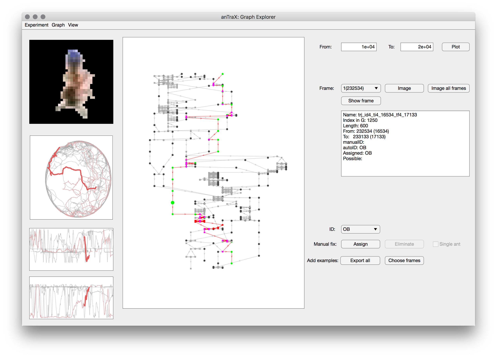

### Propagating IDs on tracklet graphs

To run propagation in batch mode:

```console
antrax solve <experiments> [OPTIONS]
```

The `experiments` argument can be either a full path to an experimental directory, a full path to a text file with a list of experimental directories (all of which will run in parallel), or a full path to a folder that contains one or more experimental directories (all of which will run in parallel).


The solve command accepts the following options:

`--nw <number of workers>`

anTraX will parallelize the tracking by video. By default, it will use two MATLAB workers. Depending on your machine power, this can be changed by using this option. 

`--glist <list of graph indices>`

By default, anTraX will track all graphs in the experiment. This can be changed by using this option. Graph indices are an enumeration of movie groups according to the options set in the session configuration. Example for valid inputs include: `4`, `3,5,6`, `1-5,7`.

`--clist <list of colony indices>`

If the experiment is multi-colony, by default, anTraX will run all colonies in the experiment. This can be changed by using this option. Colony indices are 1 to the number of colonies. Example for valid inputs include: `4`, `3,5,6`, `1-5,7`.


`--session <session name>`

If your experiment contains more than one configured session, anTraX will run on the last configured one. Use this option to choose a session explicitly.


### Using the graph explorer to view and debug ID assignments

To launch:

```console
antrax graph-explorer <expdir> [--session]
```

> **Note:** Due to a bug, the graph-explorer app cannot be lanched from the command line in MCR (compiled) mode. As a workaround, it can be launched from the anTraX main app, by selecting it from the **Tools** menu, after loading an experiment. 



* To load a graph, choose a movie (and a colony if applicable) under the 'Graph' menu.
* To highlight a specific ID, choose it in the 'View' menu. The subgraph of that ID will highlight in the graph plot, and its trajectory will highlight in the xy plots on the left.
* To see details of a specific tracklet, select its node in the graph plot. The details will appear in the text box on the right. The part of the trajectory corresponding to that tracklet will show as thickened lines on the xy plots on the left.
* When selecting a single-animal tracklet, the first cropped image of that tracklet will appear in the top left panel. You can move between frames by using the drop down menu above the tracklet text box, or press 'Image all frames' to open a separate window with a montage view of all the cropped images of the tracklet. When a multi-animal tracklet is selected, you can load its cropped image by pressing the 'Image' button.
* Use the 'Show frame' button to show an image with the blob marked on its corresponding video frame.
* You can assign an ID to a tracklet to override or augment the results of the propagation algorithm. You can also mark a tracklet as single-animal. Note that you will need to rerun the propagation step to observe the effects of these fixes.
* You can export the cropped images of a specific tracklets using the buttons on the bottom row. This is useful in case you tumble upon a misclassified tracklet.