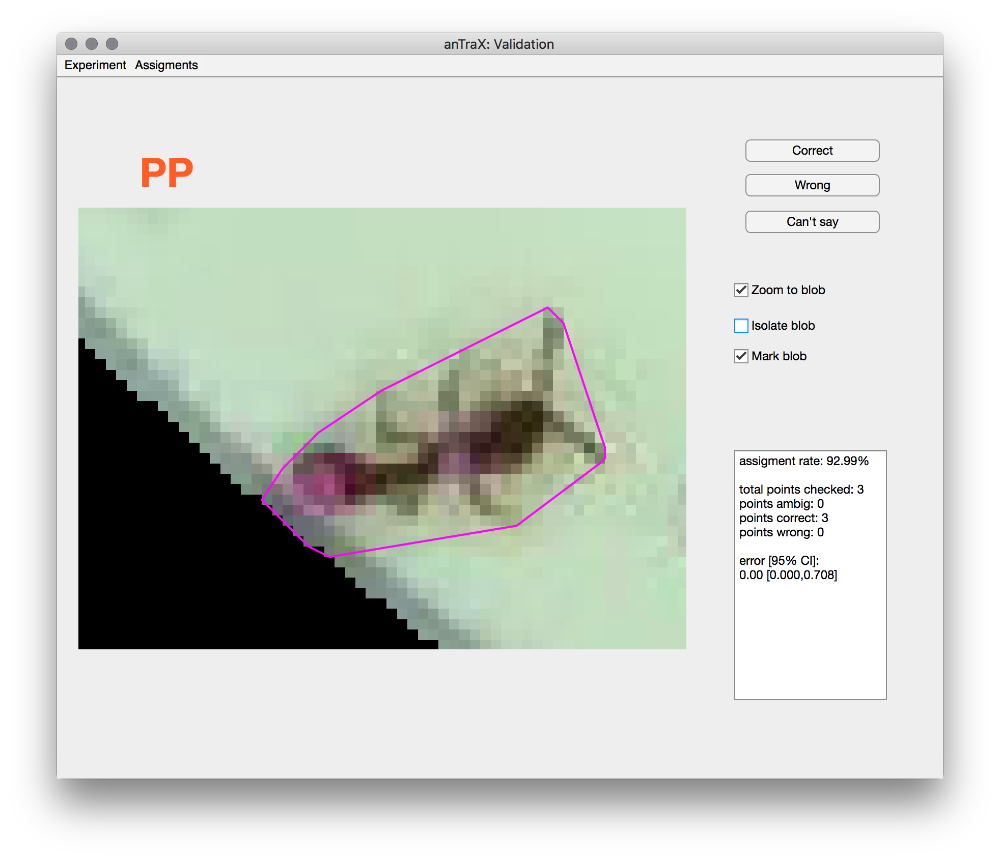

### Validating tracking results

Generally speaking, the performance of the tracking algorithm can be captured using two separate measures. The first is the rate of assignment, defined as the ratio of assigned locations in the experiments to the total possible assignments (i.e. the number of IDs times the number of frames). The second measure is the assignment error, defined as the ratio of wrong assignments to the total number of assignments made. While the assignment rate can be computed directly and precisely from the tracking results, the error rate in assigning IDs for a given data set needs to be tested against human annotation of the same dataset. Often, it is impossible to do because the recording duration of these datasets is typically long (many hours); therefore it is impractical to manually annotate them in full. Moreover, the performance of tracking will usually depend on many factors that are specific to a given dataset, so for every new experiment we will need to redo the error estimation procedure.

As an alternative, we use a validation procedure in which a sequence of randomly selected test points is presented to a human observer, where each test point corresponded to a location assignment made by the software to a specific ID in a specific frame. The user is then asked to classify the assignment as either ‘correct’ or ‘incorrect’. If the user is unsure of the correctness of the assignment, they could skip to the next one. The number of times this process is repeated depends on the required power of the error estimation. 

### Using the validation app

anTraX includes a graphical interface to easily validate tracking results. To launch:

```console
antrax validate <expdir> [--session <session>]
```

The app will randomly select an assigment of an ID to a blob. The user should respond by pressing either ***Correct***, ***Incorrect***, or ***Can't say***. The text-box will display the accumulated error and its confidence interval. Use the ***Assigment*** menu to estimate the error for a specific ID, time range, or a colony (for multi-colony experiments).

